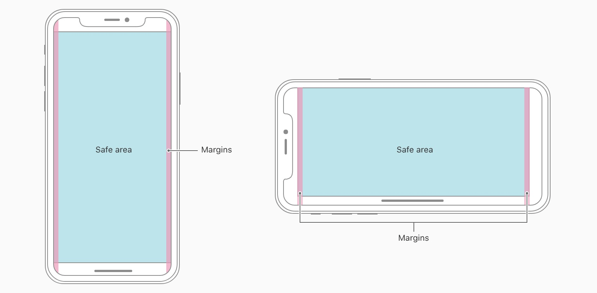
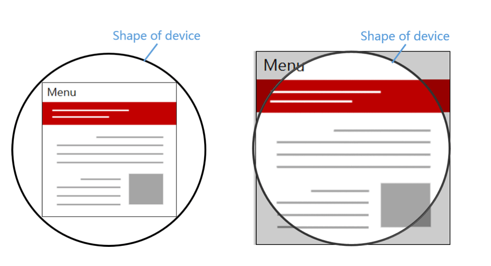
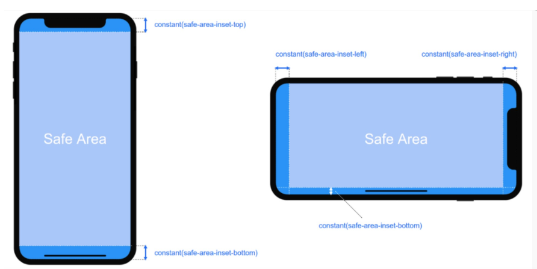
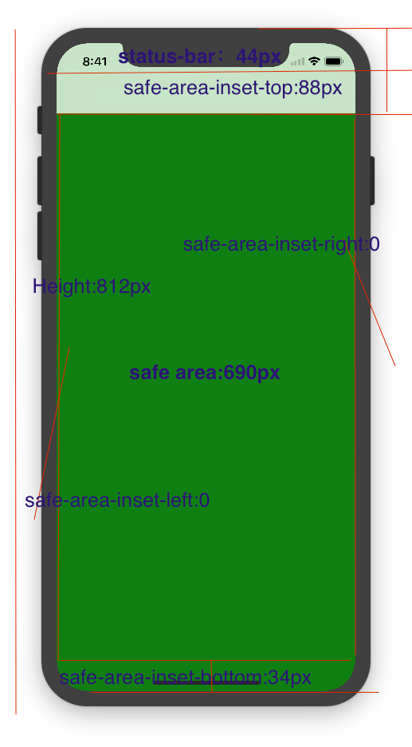

#### 一、适配iphoneX背景
iPhoneX及以上新出机型取消了物理按键，改成底部小黑条，这一改动导致网页出现了比较尴尬的屏幕适配问题。对于网页而言，顶部（刘海部位）的适配问题浏览器已经做了处理，所以我们只需要关注底部与小黑条的适配问题即可（即常见的吸底导航、返回顶部等各种相对底部 fixed 定位的元素）。
#### 二、iphoneX的安全区
安全区域指的是一个可视窗口范围，处于安全区域的内容不受圆角（corners）、齐刘海（sensor housing）、小黑条（Home Indicator）影响，如下图蓝色区域：

我们想要做好适配,就要保证页面可视可操作的区域在安全区内;
#### 三、储备
`viewport-fit` viewport-fit:苹果公司为了适配iPhoneX及以上新机型,特别在ios11版本以上新扩展了meta-viewport标签,新增了viewport-fit属性,用于设置网页在可视窗口的布局方式,可设置三个值分别为:

contain:可视窗口完全包含网页内容;(左图) `contain`

cover:网页内容完全覆盖可视窗口;(右图) `cover`

auto:默认值,等同contain; `auto`


`env函数` env函数:同样是ios11版本以上新增的一个特性,Webkit 的一个 CSS 函数，用于设定安全区域与边界的距离，有四个预定义的变量:
safe-area-inset-left: 安全区域距离左边边界距离 safe-area-inset-left

safe-area-inset-right:安全区域距离右边边界距离 safe-area-inset-right

safe-area-inset-top:安全区域距离顶部边界距离 safe-area-inset-top

safe-area-inset-bottom:安全区域距离底部边界距离 safe-area-inset-bottom

直观感受看下图:



竖屏时:safe-area-inset-left=0; safe-area-inset-right=0; safe-area-inset-top=78px(不建议用具体值); safe-area-inset-bottom=34px(不建议用具体值);

横屏时:safe-area-inset-top=0;

!!! `注意` safe-area-inset-bottom 这个变量,对应的就是小黑条的高度(横竖屏时值不一样).
#### 四、具体适配方案
1:全页面适配:

第一步:meta标签设置: (iphoneX全屏展示)
`<meta content="...viewport-fit=cover">`
第二步:将网页设置在安全区域内:(此步骤不处理的话,页面会全屏溢出展示,页面无操作按钮纯展示等特殊需求时可不做处理)
```css 
body {
    padding-top: env(safe-area-inset-top);
    padding-left: env(safe-area-inset-left);
    padding-right: env(safe-area-inset-right);
    padding-bottom: env(safe-area-inset-bottom)
}
```
第三步:fixed元素适配:(完全吸底按钮bottom=0)!!!必须有背景色,不然最底层会镂空 *注意*
```css
btns {
    padding-bottom: env(safe-area-inset-bottom);
    background-color: white;:
}
```
或
```css 
btns {
    height: calc(60px(之前默认高度) + env(safe-area-inset-bottom));
    background-color: white;:
}
```
2.筛选将适配方案只添加给目标机型:方案1:媒体查询(靠谱);2.ios新特性判断(不可用)

方案一:媒体查询
```css 
@media only screen and (device-width: 375px) and (device-height: 812px) and
(-webkit-device-pixel-ratio: 3) {
    body {...}
    btns {...}
}
```
方案二:ios新特性判断(根据是否有支持ios11 增加新特性安全区域来判断是不是iphoneX，判断的是系统，不是机型，所以对于其他安装了iOS11以上的机子会有问题。)
```css
@supports (bottom: constant(safe-area-inset-top)) or (bottom: env(safe-area-inset-top))  {
    body {...}
    btns {...}
 }
```