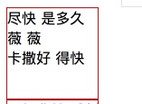
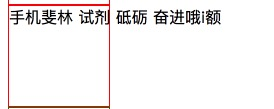
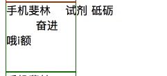
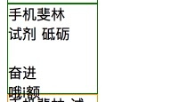
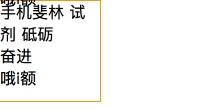

### 空格处理(white-spce)
---
### 1.normal(默认)
1. 元素内部的文字空格合并(多个空格合并成一个),文字内容超过容器的宽度回换行.
2. `<br/>`会导致换行.
3. 源码中的换行作为空格处理.
```html
<style>
.white-space {
    width: 100px;
    height: 100px;
    border: 1px solid red;
}
</style>
<div class="white-space">尽快 是多久薇
        薇<br />卡撒好 得快</div>
```

### 2.nowrap(不换行)
1. 和normal一样会合并空格,代码内换行会作为空格处理.`<br/>`会导致换行.
2. 不同的是内容超过容器宽度,会溢出盒子外.
3. 所以常和`overflow:hidden;text-overflow: ellipsis;`配合使用.溢出的文本显示`...`.
```html
<style>
.white-space {
    width: 100px;
    height: 100px;
    border: 1px solid red;
    white-space: nowrap;
}
</style>
 <div class="white-space1">手机斐林 试剂 砥砺
        奋进哦i额</div>
```

### 3.pre
1. 源码代码中的空格不会合并,有几个会显示几个.
2. 空格和`<br/>`都会显示.
```html
<style>
.white-space {
    width: 100px;
    height: 100px;
    border: 1px solid green;
    white-space: pre;
}
</style>
<div class="white-space2">手机斐林 试剂 砥砺
        奋进<br />哦i额</div>
```

### 4.pre-wrap
1. `white-space:pre-wrap`和`white-space:pre`的区别就是会自适应容器的边界进行换行.
```html
<style>
.white-space {
    width: 100px;
    height: 100px;
    border: 1px solid green;
    white-space: pre-wrap;
}
</style>
 <div class="white-space3">手机斐林 试剂 砥砺
        奋进<br />哦i额</div>
```

### 5.pre-line
1. `white-space:pre-line`的作用是合并空格，换行和`white-space:pre-wrap`一样.
2. 遇到源码中的换行和`<br/>`会换行，碰到容器的边界也会换行.
```html
<style>
.white-space {
    width: 100px;
    height: 100px;
    border: 1px solid orange;
    white-space: pre-line;
}
</style>
 <div class="white-space4">手机斐林 试剂 砥砺
        奋进<br />哦i额</div>
```
