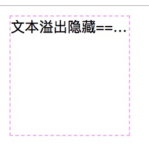
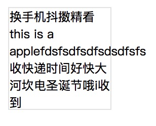
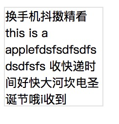
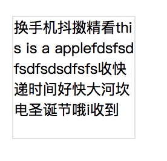

## 文本溢出隐藏

```html
<style>
    .text-overflow {
        width: 100px;
        height: 100px;
        border: 1px dashed #e8e8;
        font-size: 12px;
        text-overflow: ellipsis;
        white-space: nowrap;
        overflow: hidden;
    }
</style>
<!-- 文本溢出隐藏 -->
<div class="text-overflow">
    文本溢出隐藏===================黄四大行i说说滴是啥<br/>
</div>
```
::: tip
text-overflow: ellipsis; // 文本溢出显示省略号.<br/>
white-space: nowrap; // 文本不换行.<br/>
overflow: hidden; // 需要溢出隐藏触发
:::

## 文本单词断行

默认情况下浏览器中文自动断行,不需要处理.当存在数字或者单词时不会进行单词内断行,单词过长会超过容器.



使用`word-wrap: break-word;`处理后



加上`word-break: break-all;`后


```html
<style>
.word-wrap {
        width: 100px;
        height: 100px;
        display: inline-block;
        margin-left: 20px;
        border: 1px solid #e8e8e8;
        font-size: 12px;
        word-wrap: break-word; // 是否允许单词内断行
        word-break: break-all; // 控制单词断行的方式
}
</style>
<div class="word-wrap">
    换手机抖擞精看this is a applefdsfsdfsdfsdsdfsfs收快递时间好快大河坎电圣诞节哦i收到
</div>
```
::: tip
word-wrap: break-word; // 是否允许单词内断行(没有该属性则单词会超出容器)
word-break: break-all; // 控制单词断行的方式(没有则存在this前有大片空行)
:::

