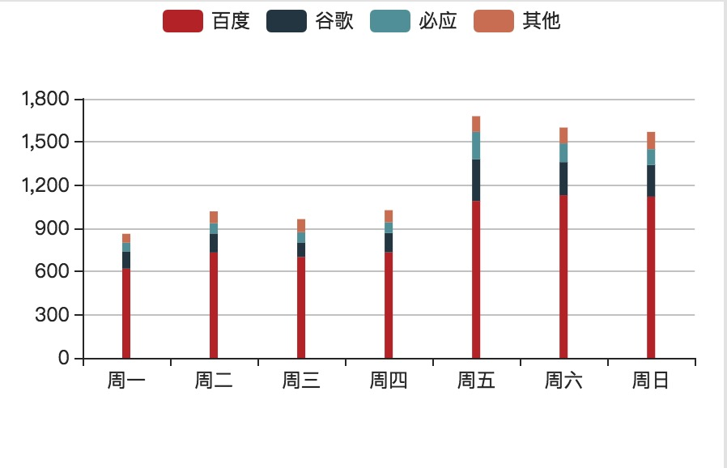
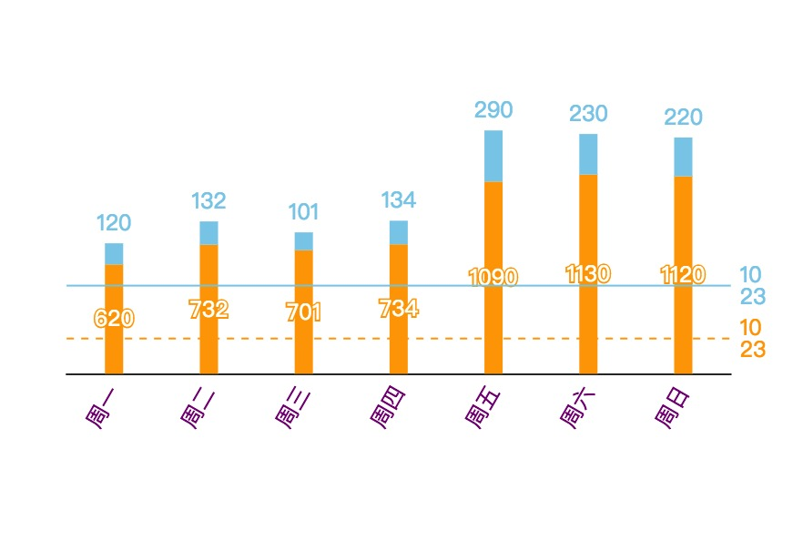

## Echarts Api


```js
/**
 * @file: comp.js
 * @author: yuzhuang
 */

import React, {Component} from 'react';
import {h, r, c, observable, setProps, action, model, observer, suh} from 'utils/erp';
import ECharts from 'comps/EChartsForReact';

const CLASS_PREFIX = 'part-list2-';
@model
@observer
export default class IndexPage extends Component {

@action
getOption() {
    return {
        tooltip : {
            trigger: 'axis',
            axisPointer : {            // 坐标轴指示器，坐标轴触发有效
                type : 'line'        // 默认为直线，可选为：'line' | 'shadow'
            }
        },
        // legend: { // 图例
        //     data:['直接访问','邮件营销','联盟广告','视频广告','搜索引擎','百度','谷歌','必应','其他']
        // },
        grid: {
            left: '3%',
            right: '4%',
            top: '20%',
            containLabel: true
        },
        xAxis : [
            {
                type : 'category',
                data : ['周一','周二','周三','周四','周五','周六','周日'],
                axisTick: { // 坐标轴刻度
                    show: false // 隐藏坐标轴刻度
                },
                axisLabel: { // 坐标轴刻度标签的设置
                    rotate: 60,
                    color: 'red'
                }
            }
        ],
        yAxis : [
            {
                type : 'value',
                show: false // 隐藏y轴
            }
        ],
        series : [
            {
                name:'搜索引擎',
                type:'bar',
                barWidth : 10, // 柱状数据图宽度
                stack: '搜索引擎', // stack相同则值可以堆叠(在一个柱形中)
                data:[862, 1018, 964, 1026, 1679, 1600, 1570],
                label: { // 图形上的文本标签,名称值等
                    normal: {
                        show: true,
                        position: 'inside'// 值的位置
                    }
                },
                markLine : { // 图标标线
                    symbol: 'none', // 标线两段的标记类型
                    data: [
                        {
                            yAxis: 500
                        }
                    ],
                    label: {
                        normal: {
                            show: true,
                            formatter: '10\n23',
                            color: 'orange'
                        }
                    },
                    lineStyle: {
                        normal: {
                            color: 'orange',
                            type: 'dashed'
                        }

                    }
                }
            },
            {
                name:'百度',
                type:'bar',
                barWidth : 5,
                stack: '搜索引擎',
                data:[620, 732, 701, 734, 1090, 1130, 1120],
                label: {
                    normal: {
                        show: true,
                        position: 'top' // 在柱状图上方
                    }
                },
                markLine: { // 图标标线
                    symbol: 'none',
                    data: [
                        {
                            yAxis: 200
                        }
                    ],
                    label: { // 图标标线的标签样式设置
                        normal: {
                            show: true,
                            formatter: '10\n23',
                            color: 'skyblue'
                        }
                    },

                    lineStyle: {
                        normal: {
                            color: 'skyblue',
                            type: 'solid'
                        }

                    }
                },
            }
        ]
    };
}

renderEcharts() {
    return (
        h(ECharts, {
            option: this.getOption()
        })
    )
}

render() {
    return (
        h.div(c(CLASS_PREFIX + 'wrapper'), {
                style: {
                    width: '900px',
                    height: '300px',
                    border: '1px solid #E8E8E8',
                    display: 'inline-block'
                }
            },
            h.div('echarts-demo', {
                    style: {
                        width: '50%',
                        height: '300px',
                        display: 'inline-block',
                        border: '1px solid #E8E8E8'
                    }
                },
                this.renderEcharts()
            ),
            h.div('echarts-demo', {
                    style: {
                        width: '50%',
                        height: '300px',
                        display: 'inline-block',
                        border: '1px solid #E8E8E8'
                    }
                },
                this.renderEcharts()
            )
        )
    )
}

}
```


