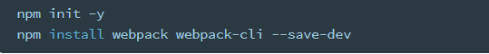
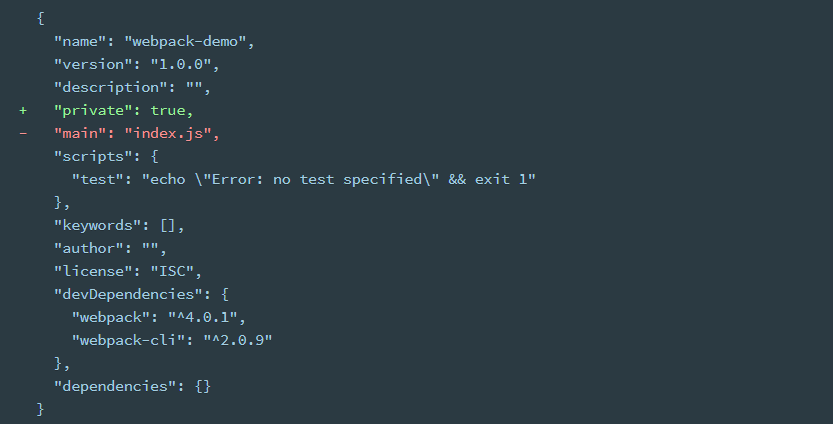
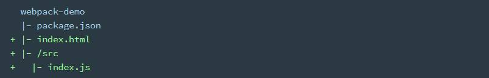

## Webpack Basic Setup

>  Webpack本身是一个打包工具。JavaScript模块打包之后就可以运行在浏览器中。

1. 首先初始化npm,此过程会创建package.json.
2. 在安装webpack包
3. Webpack-cli此包用来让webpack在命令行中能够执行
4. 为什么用`--save-dev` (等于-D);因为打包工具只在开发时使用,当项目开发完后就不在需要打包工具所以讲将其保存在开发目录中不保存在不同的依赖项中.



#### npm的配置

1. 在package.json中添加private(私人的)：true.
   - 为了防止无意间把自己的项目当作第三方包提交到了npm.
   - 所以建议在自己的项目中都设置此选项为true(不提交此包)


2. 删除main：index.js
   - main属性一般用于第三方包加载的入口模块说明。比如query会将main设置为main：”./dist/jquery.js”----当别的用户require（‘jquery’）时会找到package.json中的main属性加载dist中的jquery.js文件.



[学习更多关于NPM](https://docs.npmjs.com/files/package.json)

#### webpack demo

1. 现在跟着一下结构(structure),进行目录文件的创建.

   

**src/index**

```js
function component() {
  let element = document.createElement('div');

  // Lodash, currently included via a script, is required for this line to work
  element.innerHTML = _.join(['Hello', 'webpack'], ' ');

  return element;
}

document.body.appendChild(component());
```

**index.html**

```html
<!doctype html>
<html>
  <head>
    <title>Getting Started</title>
    <script src="https://unpkg.com/lodash@4.16.6"></script>
  </head>
  <body>
    <script src="./src/index.js"></script>
  </body>
</html>
```

在这个例子中,在script标签中有隐藏的(implicit)依赖项(dependencies).在这个页面运行前,我们的index.js文件依赖的lodash,会被包含进去,这是因为index.js从没有明确的(explicitly )公开的(declared )一个需要的lodash.它仅仅假设了一个存在的全局变量 **_**.

**这样管理js项目有很多问题**

1. 不能迅速的明显的(apparent )看到这个script依赖哪些第三方库(external library).
2. 如果这个依赖项少了或者包含一些错误的命令,这个程序不会合适地运行(function).
3. 如果依赖项被加载但是没用,这个浏览器会被强制下载不需要的代码.

用webpack去替代管理这些scripts.

## Creating a Bundle

首先我们因该将我们的目录(directory)结构(structure)进行轻微地(slightly)微调(tweak).分离我们的源代码和发版代码.这个源代码是我们会写和编辑.这个distribution code (dist/)是我们构建过程后最小化的(minimized)和最佳化的(optimized)output.最后地(eventually)会被浏览器载入的代码.

```js
  webpack-demo
  |- package.json
+ |- /dist
+   |- index.html
- |- index.html
  |- /src
    |- index.js
```

为了打包index.js里的lodash的依赖项,需要安装本地依赖项.

```shell
npm install --save lodash
```

> 当安装的package需要被打包进production bundle,你应该用`npm install --save`.如果你将要安装的包是为了开发用的目的,因该用`npm install --save-dev`.[学习更多npm](https://docs.npmjs.com/cli/install)

1. npx是npm中的一个包执行命令相当于执行了node_modules中的.bin文件下的webpack.cmd命令
2. 所以可以用下图命令代替


npx webpack-详解

1. 找到./src中的index.js入口文件
2. 分析文件中的依赖(指文件中require或其他方式引用的模块，下载但没用不会进行打包)
3.  打包构建，将结果打包到./dist中的main.js(如果有mian.js文件就覆盖，如果没有就创建一个main.js)

Webpack-配置demo

   

webpack.config.js是webpack中的配置文件，可以自定义设置

1-   entry是打包的入口文件

2-   output是打包的出口文件filename是打包后的文件名-path是打包后的文件目录(必须是动态的绝对路径C:dij/dd/dsd/这种的固定路径也不行----必须是动态的绝对路径比如用：path.join(__dirname,’./dist/’)

运行webpack 采用新的配置文件webpack.config.js


在package.json中的scripts中设置

”build”: ’webpack --config webpack.config.js’

在运行也可以进行打包（在scripts中设置不需要npx了）

因为默认的配置文件就是webpack.config.js所以build可以省略设置为

”build”: ’webpack’

**当入口文件和依赖项中的代码改变时就会自动打包******

“build-watch”: “webpack --watch”

## Using source maps


打包之后的代码位置会改变-所以报错信息的位置会和源码的位置不相同，所以需要设置配置项devtool：inline-source-map(加入源代码地图，调试信息可以看到源代码的位置)

打包其它资源

Webpack是一个模块打包平台，但是它只能打包JavaScript模块。对于其它的文件模块资源，则需要第三方loader来处理。

例如：

Css打包


-D是--save--dev的缩写

首先安装加载器

1-   style-loader(运行期间动态生成style标签插进head标签中)

2-   css-loader(将css文件模块转成Js模块)


图片打包

Less打包

Sass打包

## Asset Management

Prior to webpack(在webpack之前),前端开发者回利用grunt和gulp,来处理(process)图片等资源.移动它们从/src目录到/dist或者/build目录.这种idea同样会被用在js模块中,但是像webpack这样的工具,会动态地打包(**dynamically bundle**)依赖项(创造所谓的依赖图).

This is great because every module now *explicitly(明确地) states(规定) its dependencies* and we'll avoid bundling modules that aren't in use.

##### CSS

为了在 JS module中引入(import)css文件,需要引入style-loader和css-loader.

```bash
npm install -D style-loader css-loader
```

**使用less** 需要安装less和less-loader

```bash
npm install -D less less-loader
```

##### Image&Fonts

为了在 JS module中引入图片资源(png|jpg|gif|svg)和字体资源(woff|woff2|eot|ttf|otf),需要使用file-loader.

```bash
npm install -D file-loader
```

---

#### JS编译

**Why Need To Be Compiled**

1. 浏览器不能完全支持js的新语法.
2. JSX and TS不能再PC端运行.

**Babel**

​	Babel是JS的编译器(compiler)

**Usage**

```shell
npm install -D babel-loader @babel/core @babel/preset-react
```

`@babel/preset-react`是react需要的预设环境包括编译JSX.

新版本的Babel进行了名称的修整,`babel => @babel/`,preset和plugin的名字会从包中移除.

`@babel/preset-react` => `@babel/react` (this is equivalent)

---

#### Development

```shell
devtool: "inline-source-map" // 定位错误在哪个文件那一行.
```

```shell
package.json =>
"watch": "webpack --watch" // 当代码修改时只能重新编译,但是浏览器不会自动刷新.
```

```shell
npm install -D webpack-dev-server // 所以使用热加载(重新编译,自动刷新)
```

```shell
package.json =>
"start": "webpack-dev-server --open --host 127.0.0.1"
```

配置web-dev-server时报个错(因为本地的hosts文件里设置localhost => 127.0.0.1)所以找不到.但是配了依然找不到.so 临时加入--host 127.0.0.1配置.

```shell
events.js:154
      throw er; // Unhandled 'error' event
      ^

Error: getaddrinfo ENOTFOUND localhost
    at errnoException (dns.js:26:10)
    at GetAddrInfoReqWrap.onlookup [as oncomplete] (dns.js:77:26)
```

---

 #### Production

生产环境和开发环境的区别:

1. 生产环境压缩代码.
2. 生产环境使用节省性能的source-map,开发环境使用debug方便的source-map.

---

#### webpack-merge 

```bash
npm install -D webpack-merge
```

1. webpack.common.js包含通用的打包代码.
2. webpack.dev.js包含开发的代码.
3. webpack.prod.js包含生产的代码.

利用webpack-merge,可以将common的代码合入到dev和生产的代码.
## Caching
当我们正在用webpack去打包自己的模块化程序(modular application)时会产生一个可部署的`/dist`目录.
一旦`/dist`里的内容发版到服务器后,客户端(clients)会访问(hit)服务器去拿到(to grap)网站和资源.这一步是非常耗时的(The last step can be time consuming).这是为什么浏览器用了一个缓存的技术.允许网站载入的更快,不需要用过多的网络流量.然而当你需要拾起new code时,会有头痛的问题.
### Output Filenames
最简单的解决办法是改变输出的文件名,可以用[hash]或者[contenthash]来替换输出的文件名,推荐用[contenthash]因为内容的hash不会重复.